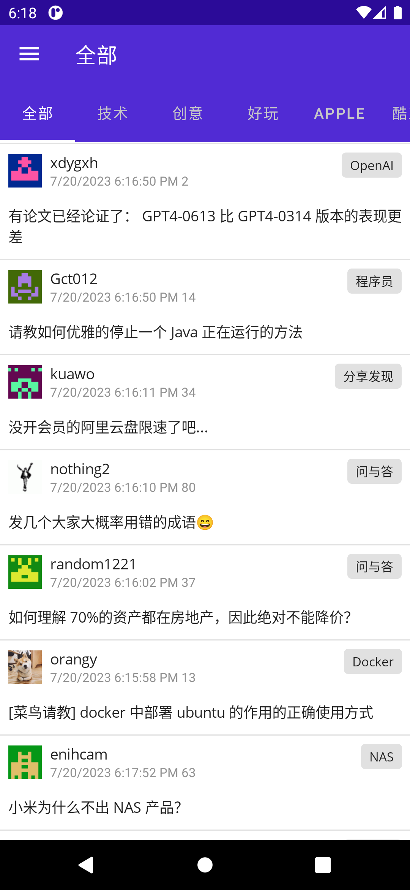
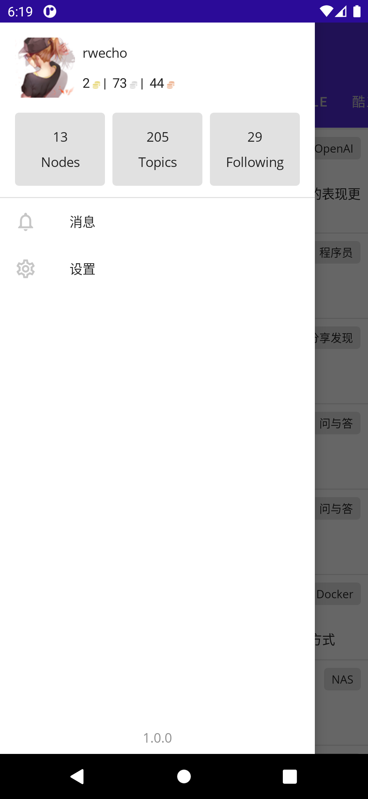
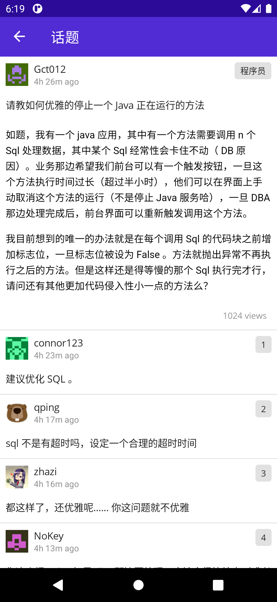
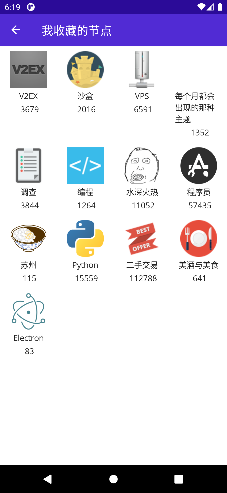
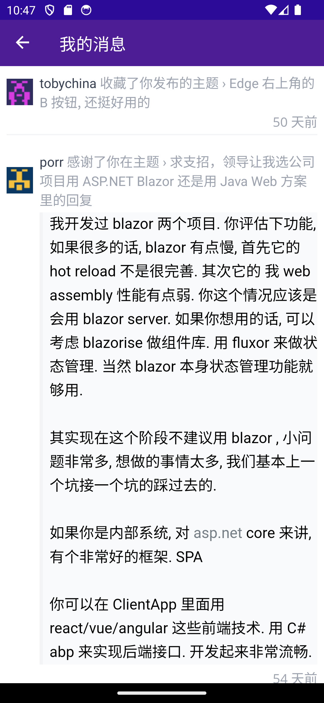

# V2ex.MAUI

I believe this project might seem unnecessary since there are already many excellent apps that everyone is familiar with. However, with the upcoming release of .NET Core 8.0 and the growing interest in the .NET community, I want to seize this opportunity to establish this project. Currently, it remains a rough prototype with only a few basic features, far from being fully functional and user-friendly. But I trust that with a better understanding of app development, I will shape this app into a multi-platform, user-friendly, and feature-rich V2ex application.

## Screenshots

## Features

__basic functions__

* Login
* Tab topics
* Topic 
* My Favorites
* Settings

## Contributes

Welcome everyone to contribute and participate! If you need a specific feature, you can start by submitting an [issue](https://github.com/rwecho/V2ex.MAUI/issues) for discussion. Alternatively, you are also encouraged to [fork](https://github.com/rwecho/V2ex.MAUI/fork)  the repository, make changes, and submit a pull request (PR).

<!-- ALL-CONTRIBUTORS-LIST:START - Do not remove or modify this section -->
<!-- prettier-ignore-start -->
<!-- markdownlint-disable -->
<table>
  <tbody>
    <tr>
      <td align="center" valign="top" width="14.28%"><a href="https://github.com/rwecho"> <b>RWECHO</b></a> <a href="https://github.com/rwecho/V2ex.Maui/commits?author=rwecho" title="Code">💻</a></td>
    </tr>
  </tbody>
</table>

<!-- markdownlint-restore -->
<!-- prettier-ignore-end -->

<!-- ALL-CONTRIBUTORS-LIST:END -->
<!-- prettier-ignore-start -->
<!-- markdownlint-disable -->

<!-- markdownlint-restore -->
<!-- prettier-ignore-end -->

<!-- ALL-CONTRIBUTORS-LIST:END -->

For details please visit [insights](https://github.com/rwecho/V2ex.Maui/graphs/contributors)

## Acknowledges

- [V2ex](https://www.v2ex.com) 

- [V2er](https://github.com/v2er-app/Android) 
    
    V2er is my daily app. 
    
    > V2er is a mobile app for the V2EX website, a community-driven forum that discusses a wide range of topics such as technology, programming, and lifestyle.   
- [Abp](https://github.com/abpframework/abp) 

    > ABP is an open-source application framework for ASP.NET Core that helps developers create modular and maintainable applications.

- [MAUI](https://github.com/dotnet/maui)
- [CommunityToolkit/Maui](https://github.com/CommunityToolkit/Maui)
- [HtmlAgilityPack](https://github.com/zzzprojects/html-agility-pack)
## License
The source code is licensed under MIT. License is available [here](./LICENSE.txt)