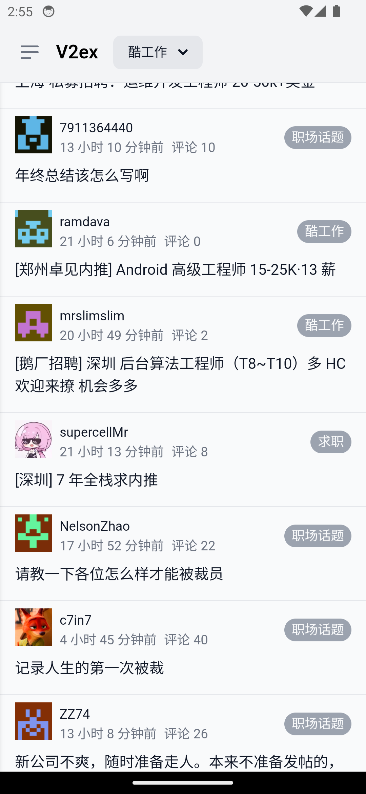
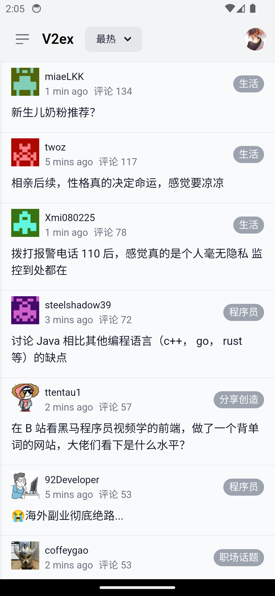
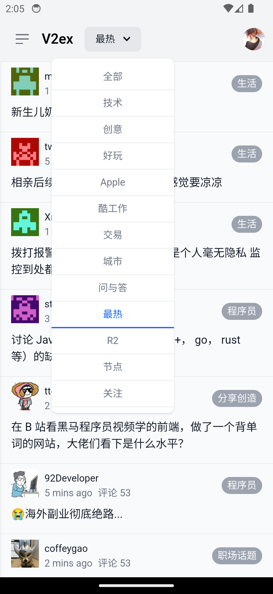
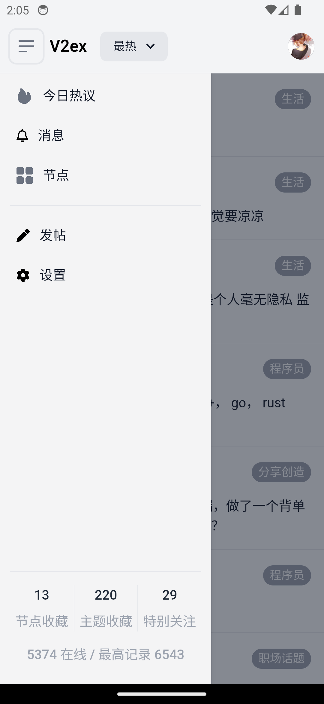
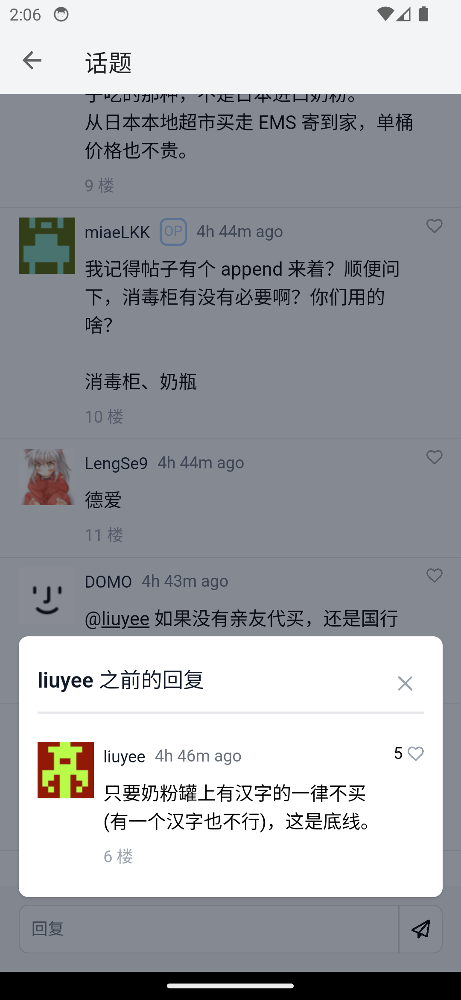

# V2ex.MAUI

It is a cross-platform app for V2EX, which is built with Maui Hybrid. It is currently only available for Android devices. This app is still under development, the app is still in the early stages of development, and there are still many bugs and incomplete features. If you have any questions or suggestions, please feel free to submit an [issue](https://www.github.com/rwecho/V2ex.MAUI/issues) or [PR](https://www.github.com/rwecho/V2ex.MAUI/pulls).

## Screenshots

## Download

|  |  |
| ------------------------------------------------------------------------------------------------------------------------------------------------------ | -------------------------------------------------------------------------------------------------------------------------------------------------------------------------- |

- **AppCenter** downloaded the latest version of the app, which may be unstable.

## Features

1. **basic functions**

   - Login
   - Tab topics
   - Topic page
   - My Favorites
   - My Nodes
   - My Notifications
   - Settings

2. **todo in the future**

   - [x] Search
   - [x] Animation and gesture
   - [x] Rich text input
   - [x] User profile
   - [x] ChatGPT enhancement
   - [x] Dark mode

## Contributes

Welcome everyone to contribute and participate! If you need a specific feature, you can start by submitting an [issue](https://github.com/rwecho/V2ex.MAUI/issues) for discussion. Alternatively, you are also encouraged to [fork](https://github.com/rwecho/V2ex.MAUI/fork) the repository, make changes, and submit a pull request (PR).

<!-- ALL-CONTRIBUTORS-LIST:START - Do not remove or modify this section -->
<!-- prettier-ignore-start -->
<!-- markdownlint-disable -->
<table>
  <tbody>
    <tr>
      <td align="center" valign="top" width="14.28%"><a href="https://github.com/rwecho"> <b>RWECHO</b></a> <a href="https://github.com/rwecho/V2ex.Maui/commits?author=rwecho" title="Code">💻</a></td>
    </tr>
  </tbody>
</table>

<!-- markdownlint-restore -->
<!-- prettier-ignore-end -->

<!-- ALL-CONTRIBUTORS-LIST:END -->
<!-- prettier-ignore-start -->
<!-- markdownlint-disable -->

<!-- markdownlint-restore -->
<!-- prettier-ignore-end -->

<!-- ALL-CONTRIBUTORS-LIST:END -->

For details please visit [insights](https://github.com/rwecho/V2ex.Maui/graphs/contributors)

## Acknowledges

- [V2ex](https://www.v2ex.com)

  V2EX is a community of developers, designers, and creative people. It is also a place for sharing and discovery. V2EX is a place to share knowledge and experience, ask questions, and get answers.

- [V2er](https://github.com/v2er-app/Android)

  V2er is my daily app.

  > V2er is a mobile app for the V2EX website, a community-driven forum that discusses a wide range of topics such as technology, programming, and lifestyle.

- [Flowbite](https://flowbite.com/docs/)

- [Tailwindcss](https://tailwindcss.com/)

- [MAUI](https://github.com/dotnet/maui)

- [CommunityToolkit/Maui](https://github.com/CommunityToolkit/Maui)

- [HtmlAgilityPack](https://github.com/zzzprojects/html-agility-pack)

## License

The source code is licensed under MIT. License is available [here](./LICENSE.txt)
